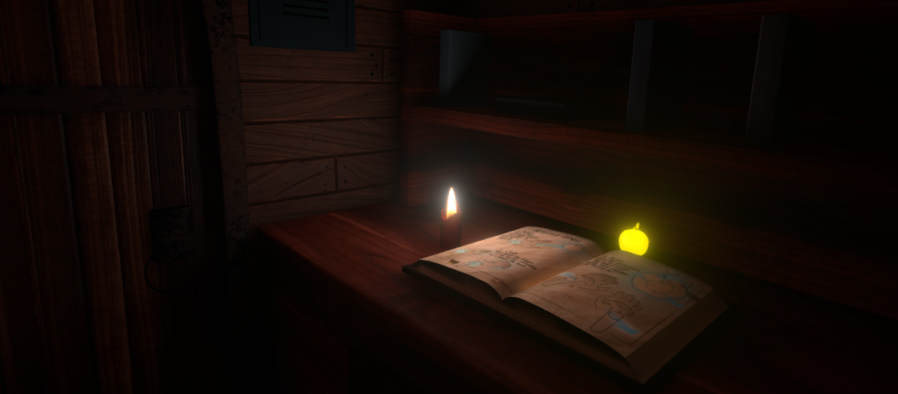

Hello! I'm Eric, and welcome to my personal website and development blog! This is where I plan on posting about various projects I've done in the past, as well as random projects and thoughts that I have. Hope you find an interesting read 😄

<!-- end -->

## Some Starting Thoughts

I'm not really a social media person, so I don't have much shared online in personal profiles on the work I've done. But I'll get to use this site for exactly that purpose! There won't really be an organization scheme as I start out here, I'll post as things come to me 😛

Alright so let's get some content in!

# Making the Site

A little about myself, I'm a VR/AR (or XR) Unity software developer, having started with making VR games for the HTC Vive back in 2016, and expanding to mobile AR games & experiences in later years. I don't have too much experience in web-dev, but I have fiddled here and there. For instance, I made a website for my startup company, Escality, over at https://escalitygames.com (*at the time of writing, I'm still working on getting that domain back, but I'm hosting a copy of that site over at https://escality.ricimon.com*).

That site was written through pure HTML/JS/CSS without any Javascript framework, so it was quite simple in interaction. Since then though, I've picked up React as my go-to web framework. I was planning on a simple create-react-app website, but then I found this neat [dev-blog template](https://github.com/RyanFitzgerald/devblog) powered by [GatsbyJS](https://www.gatsbyjs.com/).

The template's dev dependencies were a little outdated, so I spent some time upgrading all its components and solving all the compatibility issues that resulted. Having been introduced to Gatsby through this though, I can say I'm a fan of the framework! Gatsby is a React-based framework that specializes in generating static websites. What this means is that the website HTML contents you're seeing are all pre-generated and pulled directly from the server, without any additional JS processing done by your browser or the server.

Each post in this site is represented by a markdown file, and processed using Gatsby plugins to create the blog webpages. The layout and format of the website is controlled by standard React components and CSS elements declared with the [styled-components](https://styled-components.com/) plugin. It took me a bit to understand how Gatsby actually pulls the markdown data through its GraphQL queries, especially since some of the original template syntax was using older plugin versions, but the Gatsby documentation helped a lot as it had good docs on each plugin I was using.

This website's code will remain uploaded to my GitHub repo over at https://github.com/Ricimon/ricimon.com if you're interested in peeking at the source code.

## Hosting the site

From my learnings setting up the Escality website, I thought I'd host this website on some personal hardware. More specifically, I have this spare Raspberry Pi that I host my various 24/7 Discord bots on. Unfortunately, I couldn't get the Gatsby build process to work, with the `npm run build` command always failing on

```
Error: No prebuild or local build of @parcel/watcher found. Tried @parcel/watcher-linux-arm-glibc.
```

My hunch is that this package isn't supported on the old ARMv7 architecture that my Pi is running on. This would explain why the build fails on my Pi but not on my PC, even though the same Dockerfile is being used between them.

So, I turned to using [Netlify](https://www.netlify.com/) to deploy my site. I found this through the original dev-blog template, and it was pretty easy! I simply connected my GitHub repo to Netlify, and they quickly deployed my site to a Netlify subdomain. I then tweaked some DNS settings from my DNS provider to point my domains to Netlify, and just like that my site was set up, with SSL support too!

Personally though, I'd prefer if I could keep small apps and deployments on local hardware, to either avoid cloud costs or just to learn lower level concepts behind their setup. Maybe I should invest in a newer model Pi 😅

## What's with the post image?

Okay so yes, the post image is AI generated. I used [stable diffusion](https://github.com/AUTOMATIC1111/stable-diffusion-webui) with the [MeinaMix](https://civitai.com/models/7240/meinamix) model to generate it. It's actually a reimagined version of a screenshot from the VR game I made during my time in Escality! The game's [Conjuror's Eye](https://store.steampowered.com/app/805320/Conjurors_Eye/), and here's the original image.

<p align="center">
    
</p>

I even made sure to get that glowing apple in 😉

# 

And that's about it for now. I'll be sure to write more on some of the things mentioned here, like Escality and Conjuror's Eye. Cya!
