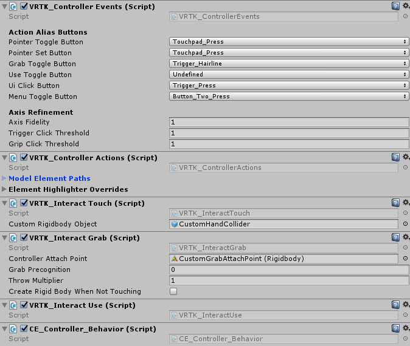

A short but sweet VR escape room made back in 2017, Conjuror's Eye is the first title I contributed to developing from start to finish and published on the Steam store.

<!-- end -->

## The Background

[Conjuror's Eye](https://store.steampowered.com/app/805320/Conjurors_Eye/) is the first game developed and published by a company I co-founded named [Escality](https://escality.ricimon.com). The game was initially made during a game jam for [Ludum Dare 38](https://ldjam.com/events/ludum-dare/38/$19724). We liked the idea enough to continue working on turning the game into a full title.

## A Brief Synopsis

Conjuror's Eye is a VR escape room game made primarily for the HTC Vive, but playable on any OpenVR-compatible devices such as the Oculus Rift. You play as a wizard who's received a delivery of a strange magical artifact. Upon inspection, the artifact sucks you in and presents a series of puzzle rooms you'll need to solve to escape, before the cube collapses in on you. You'll need to use your newly learned scaling spell to change the size of objects in order to solve the puzzles and progress. Upon reaching the last room, you find a clock that you can use to turn back time and escape the artifact.

<div align="center">
    <p style="max-width:635px">
        
    </p>
</div>

## Development Notes

As a disclaimer, it has been quite a while since I've touched the project, so I might miss some details here or there, but I'll try to hit the main points behind certain technical aspects of the game.

### The tech stack

Conjuror's Eye is built in Unity. VR support was added with the [SteamVR](https://assetstore.unity.com/packages/tools/integration/steamvr-plugin-32647) and [VRTK](https://www.vrtk.io/) plugins. Some graphical plugins include the [Amplify Shader Editor](https://assetstore.unity.com/packages/tools/visual-scripting/amplify-shader-editor-68570) and the Post-Processing Stack, which existed as a separate package back then. Steam store and achievement integration were done via the [Steamworks.NET](https://steamworks.github.io/) plugin.

### The core scaling mechanic

<div align="center">
    
</div>

The central mechanic of the game is the ability to scale the size of objects. This scaling interaction actually already existed in a form in SteamVR Home but there, scaling was done by physically holding the object with both hands. In this game, we wanted scaling to be done at a distance, especially since the sizes of some objects wouldn't make sense for them to be held. To do this, we settled on holding the trigger on one controller to activate a laser used to "select" the object to scale. Then holding trigger on the other controller would initiate scaling, and the distance between your hands would dictate how much to scale the object by. Scaling would then be deactivated by releasing the trigger on any controller.

This interaction used the fewest buttons and ended up as the most intuitive method. I actually had us avoid using the grip buttons on the Vive controller as I found them really awkward to use, especially if they had to be held down.

VRTK helped a lot in getting this interaction possible. *Keep in mind that the following VRTK classes and functions I'll talk about existed back in 2017, and I'm not sure if they still exist or function the same way now.* To start, VRTK comes with a [VRTK] prefab that includes basic functionality for a VR camera and controllers. On each controller GameObject, various VRTK components can be added in a modular fashion to add functionality. One of these components is the `VRTK_Pointer`, which normally just activates a laser point on some controller interaction. I overrode this class to provide the scaling interaction logic.

<div align="center">
    <p style="max-width:535px;font-size:90%">
        
        Some of the VRTK components on the controller GameObject
    </p>
</div>

There's a simple state machine to determine what should happen on any controller input. The first step is to make sure the scaling interaction doesn't conflict with the standard object grabbing interaction. Both of these interactions are done by holding trigger, so there's a simple check that the controller isn't touching something when trying to initiate any scaling-related action. Next, clicking the trigger on a controller performs the following steps:

1. Try to initiate the scaling process if the *other* controller is currently hovering ("selecting") a scalable object.
2. If not, activate the laser on the current controller (and deactivate the other controller's laser).
    - This is because it wouldn't make sense to select 2 scalable objects at the same time.

Once a laser is active, a `FixedUpdate` loop on the active controller performs a `Physics.Raycast` every physics frame to update what scalable object is currently hovered, if any, and also play/stop FX accordingly.

Scalable objects have a `Scalable_Object` component attached to them, which defines the lower and upper bounds of scale as well as its scaling speed. This component also contains actual scaling logic, which uses the distance between the two controllers on every frame to update all of the following:

- Object scale
- Object mass
- Particle system scale (the blue particles coming out of the object being scaled)
- Scaling FX pitch
- Controller haptics

### Level transitions

After the player solves the current level, we didn't want the next level to automatically begin, as we wanted to give the player a kind of agency for moving on. We settled on putting a copy of the initial artifact under the ground behind a pane of glass. Once a level is solved, the player will need to look at the artifact, which opens the glass, opens the artifact's eye, and then quickly shrinks the player down to transition into the next level.

<div align="center">
    
</div>

To achieve this effect, the artifact first needs to be seen through the floor. During development, the level rooms had already been built without a hole in the middle of the floor. Rather than rebuilding the floor meshes, I opted to add a "negative floor" to visually create a hole in the floor. To do this, I created a custom shader that purely wrote to the depth buffer, called a depth mask.

```hlsl
Shader "Masked/Mask" {
 
	SubShader {
 
		Tags {"Queue" = "Transparent+10" }
 
		// Don't draw in the RGBA channels; just the depth buffer
 
		ColorMask 0
		ZWrite On
 
		// Do nothing specific in the pass:
 
		Pass {}
	}
}
```

I then created a plane using a material with this shader placed over where the hole should be. Under this plane, I placed all the meshes of the hole and artifact. With the negative floor mask's material render queue set to 3010, the key to get this mask working is to set the render queue of objects it should mask (the floor) to a greater number number (3020), and the objects shown behind it to a lower number (2900). What happens here is that when viewed from above, the mask fragments (or pixels) will always be in front of the floor fragments. Following render queue order, the objects behind the hole get rendered first, then the mask, and then any floor fragments that aren't behind the mask, as with opaque materials, fragments that are behind already-processed fragments are discarded.

Quick note that these render queue numbers are around the number for normally transparent materials (3000) because there's transparent glass materials in the hole. With render queues above 2500, opaque geometry does take a bit of a performance hit as they become sorted back-to-front and lose shadows ([source](https://forum.unity.com/threads/is-there-a-defined-standard-for-material-render-queues.635980/)). Looking at this now, there's definitely room for improvement here to move these queues back to the opaque numbers.

Next up comes the logic of detecting when the player is looking at the artifact. For this, I used two steps:

1. Check if the artifact is within the player's view frustrum.
2. Make sure nothing is in the way between the artifact and the player's view.

In step 1, I wrote a simple function that used Unity's built-in `WorldToViewportPoint` function.

```csharp
public static bool CheckOnScreen(Vector3 pos, float xMin, float xMax, float yMin, float yMax)
{
    Vector3 screenPoint = Camera.main.WorldToViewportPoint (pos);
    bool onScreen = screenPoint.z > 0 && screenPoint.x > xMin && screenPoint.x < xMax && screenPoint.y > yMin && screenPoint.y < yMax;
    return onScreen;
}

```

All this does is determine if a world point is within certain bounds of the player's viewport, but it can't tell if that position is being obstructed by something. That's where step 2 comes in, and that's done by performing a physics raycast from the artifact to the player camera, which has a small sphere collider attached. If the ray hits the player camera, then we're good to start the level transition. Now, this technically doesn't work if a non-collidable mesh is in the way of the artifact and the player, but it worked for all cases in the game.

One last thing was to make sure that the player held these conditions for a short half-second duration before starting the transition sequence as opposed to holding them for just a single frame so that it was clear the player has the intention of looking at the artifact.

## Some Closing Thoughts

Those are just a couple technical features I wanted to go over and I hope that gave a glimpse into both the technical and design decisions of the game. As Escality's and my own first published title, Conjuror's Eye is definitely rough around the edges. Reading through some of the code again I somewhat remember why I wrote things this way, although I can quickly see the flaws in my old code. However, I'm still glad I was able to go through the game development process with this game, and the learnings of gameplay iteration through playtesting still hold true today.

If you happen to have VR, and you've got a spare dollar and some free time I suggest you try the game out 😊. Til next time!
