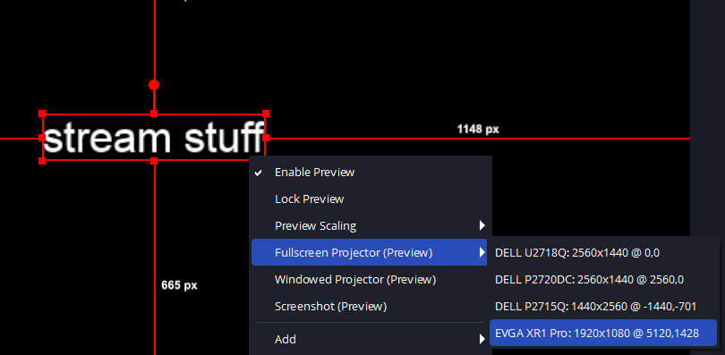
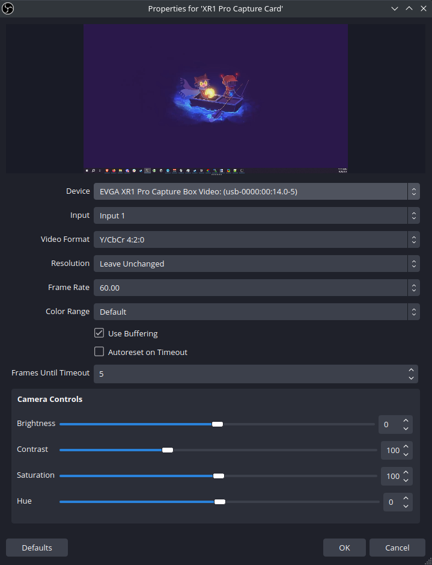
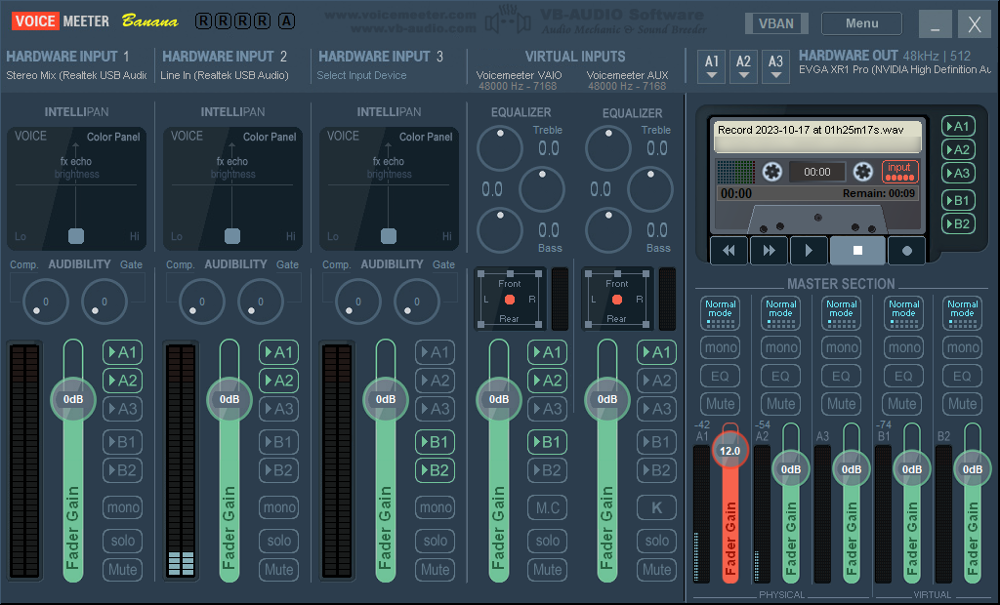
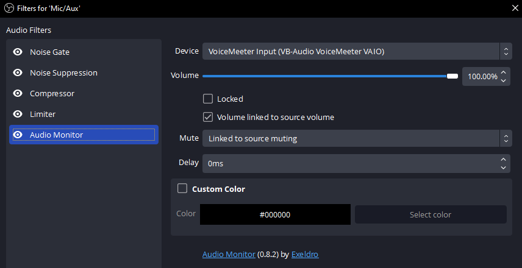
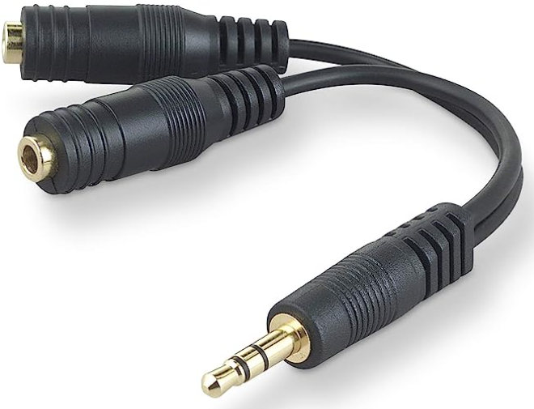

I occasionally stream my gameplay over on Twitch.tv, and with a recent computer upgrade, this is a good time to document my setup.

<!-- end -->

## Equipment

My gaming PC is running on an AMD Ryzen 9 7900X & GTX 1080, while my streaming PC is running on an Intel i5-4460 & GTX 1070. To connect the two, I use the [EVGA XR1 Pro](https://www.evga.com/products/product.aspx?pn=144-U1-CB21-LR) capture card. In terms of cabling, I use a DP-to-HDMI cable to connect my gaming PC's graphics card to the capture card input, and then a USB-C-to-A 3.0 cable to connect the capture card to my streaming PC.

My gaming PC runs on Windows 10 while my streaming PC runs on Kubuntu.

## Video

With the capture card connected to my gaming PC, I get an extra monitor in my display settings, and this is what the capture card sees. To make sure I don't accidentally lose my mouse on this invisible monitor, I put it way in the corner.

<div align="center">
    <p style="max-width:635px">
        
    </p>
</div>

For extra precautions, I even made an AutoHotkey script to recenter my mouse on my main monitor, and the F14 keybind to activate it is put on a macro pad.

```
#Warn,UseUnsetLocal
#NoEnv
#SingleInstance Force
SetBatchLines,-1

CoordMode, Mouse, Screen
Return ; stops auto execution

F14:: ; Center on PRIMARY monitor
MouseMove, A_ScreenWidth//2, A_ScreenHeight//2
return
```

While I could just mirror my main monitor on this extra monitor, I'd rather put all my stream effects on my gaming PC's OBS, as that way I can still use OBS's game capture and I wouldn't need to physically go over to my stream PC to toggle stream elements. To get my OBS feed over, I use the full screen projector preview feature.


<div align="center">
    <p style="max-width:635px">
        
    </p>
</div>

Since I stream in 1080p, I size the extra monitor to 1920x1080. Over on the stream PC, I add a Video Capture Device for the XR1, leaving everything at mostly default settings.

<div align="center">
    <p style="max-width:300px">
        
    </p>
</div>

*I haven't played around much with these settings, so there's room for fine tuning here.*

## Audio

The capture card on the gaming PC acts as an extra audio output source, and any audio that gets sent over to the streaming PC must go through this source. This is where I've fiddled with a lot of setup options, as my goal was to essentially mirror my gaming PC audio over to the streaming PC, without introducing any latency to my gaming PC audio output.

My current setup uses a [UR12 USB Audio Interface](https://www.steinberg.net/audio-interfaces/ur12/) as both my input and output source. I connect my headphones to the interface, and I also connect an extra 2-RCA-to-3.5mm cable from my interface back into the line-in port of my gaming PC. This effectively creates a loopback system where my desktop audio is looped back into an input source. I can then use Voicemeeter to send that input to the XR1 output source.

<div align="center">
    <p style="max-width:635px">
        
    </p>
</div>

*Hardware Input 2 is the looped back line-in.*

This solves desktop audio, but I need to also transfer my mic audio through the capture card. While I could just add my mic as another hardware input source, this would send *everything* my mic picks up through the capture card with only Voicemeeter filtering capabilities, since on the stream PC side, the input audio stream contains both mic and desktop audio. The Voicemeeter filters aren't enough, especially without a noise suppression filter, so I need another method here. My method is to use OBS on my gaming PC to capture mic input, apply filters, and then output it into a virtual Voicemeeter input (Voicemeeter VAIO in the picture). To do this, I apply the following filters to my mic input in OBS.

<div align="center">
    <p style="max-width:635px">
        
    </p>
</div>

The key piece here is the [Audio Monitor](https://obsproject.com/forum/resources/audio-monitor.1186/) plugin, which is what's able to send the filtered mic audio over to Voicemeeter.

Over on the streaming PC, I add a new Audio Capture Device, and have it use the EVGA XR1 Pro Capture Box Video Analog Stereo. Through my testing so far, it seems I don't need to add any audio sync offset, but do note that using the Audio Monitoring feature does not apply any sync offsets; you have to create recordings to check offset accuracy.

Back on the Voicemeeter screenshot, you'll notice that Hardware Input 1 is Stereo Mix. This is a feature of my gaming PC's sound card, which acts like the loopback system I set up with my audio interface, without any cabling. I have my desktop speakers connected directly to my motherboard, and I swap between the audio interface output and the speakers output to swap between headphone and speaker audio. This setup isn't really used that often, as I'm almost always using headphones when streaming, but it's nice to have.

### Other less viable options

I want to address some other audio setup options that I've experimented with but was not satisfied with. The first is setting Voicemeeter as my PC's primary audio output, and then using Voicemeeter to output that same audio to both my headphones and the capture card. Unfortunately, this option introduces very noticeable amounts of audio latency to my headphones, because Voicemeeter itself needs time to process the incoming audio feed. Even messing around with the Voicemeeter buffering number could not reduce the latency enough. This meant that my PC's primary audio output *must* go directly into my headphones/speakers.

Another option was to buy an audio cable splitter:

<div align="center">
    <p style="max-width:100px">
        
    </p>
</div>

But I read that these reduce the resulting audio volume as the audio signal needs to be passively split across two output sources. I wanted to be able to keep the same PC volume regardless of how many outputs I was splitting to, so I didn't go with this option.

There's also the option of using NDI to send both video and audio over LAN. I messed around with this option before getting the capture card, but I was getting really bad results in terms of both video quality and audio sync.

Lastly is the setup I was running before my PC upgrade. Using a GA-Z270X-DESIGNARE motherboard, I had the ability to natively mirror audio across multiple back audio IO ports, *and* utilize Stereo Mix as the loopback system. Unfortunately my new motherboard doesn't seem to support this feature, but also the Stereo Mix input with this setup was very quiet. I had to boost it as much as I could within Voicemeeter, but this introduced a constant background hum from overboosting.

## Closing Thoughts

This setup is by no means perfect, and there are some issues I'm still trying to address. For instance, even my gaming PC OBS preview seems to lag sometimes, but I think I'm just running into the limit of my 2016 GPU. Once I pickup a newer graphics card I'll probably upgrade my streaming PC with my old gaming PC parts as well. I also think my final stream quality is a little blurry, but hopefully that'll also be resolved with a hardware upgrade.

Anyway, that wraps up my setup details for now. I stream video gaming, mostly Final Fantasy XIV at the moment, over on https://twitch.tv/ricimon if you're interested in checking it out. Cya!
