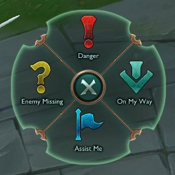
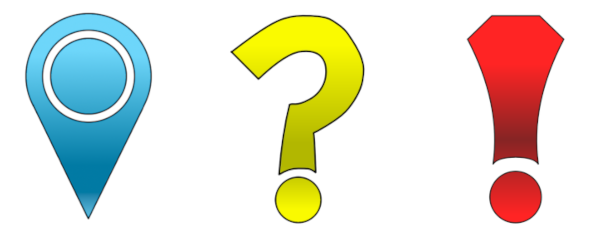
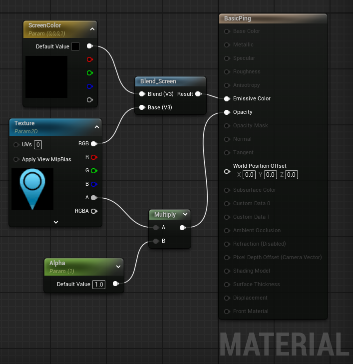
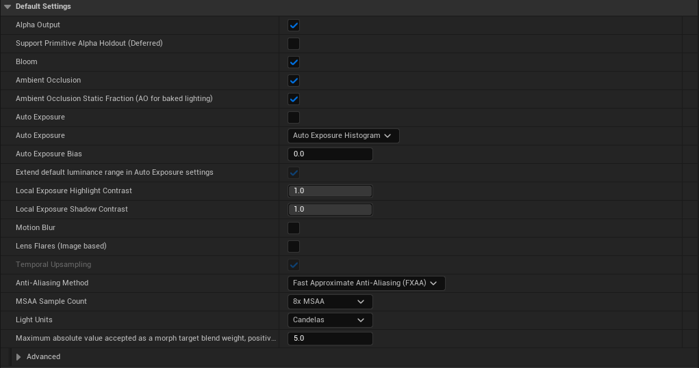
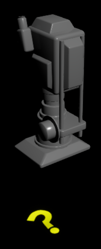
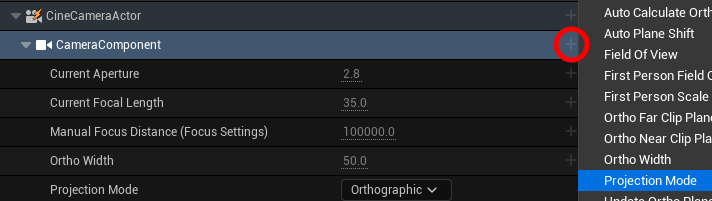
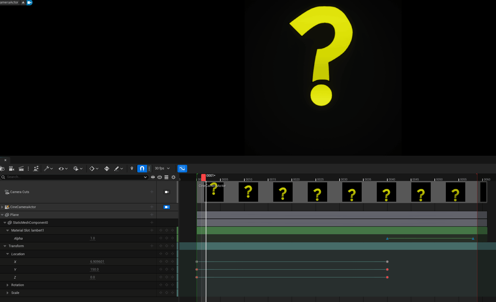
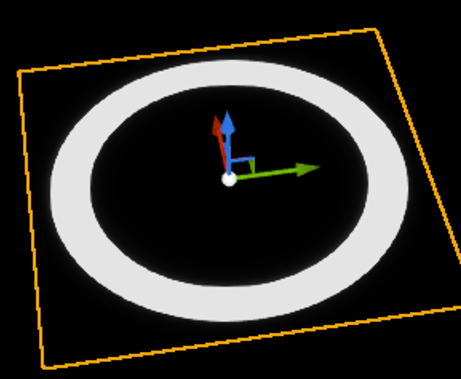
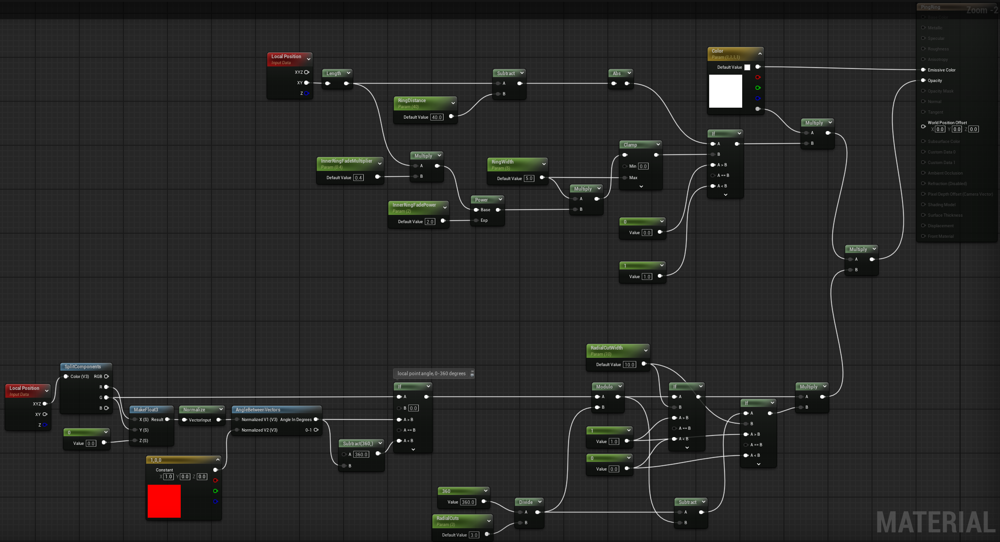
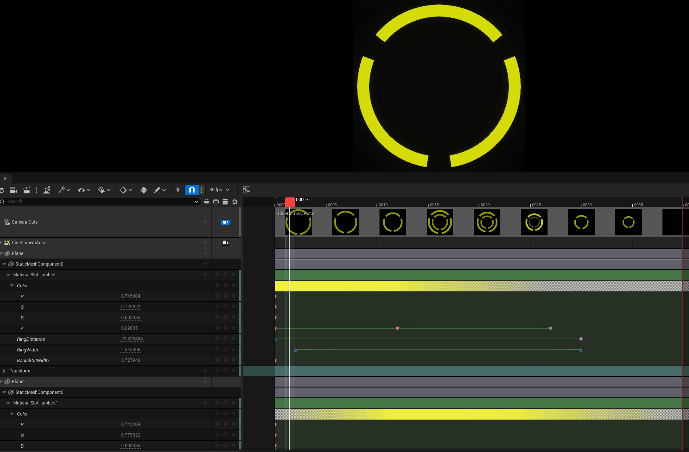

A bit of an unorthodox graphic animation medium, but Unreal Engine does have some advantages when it comes to animating simple graphics. Here I'll describe my process for creating ping animations for yet another Final Fantasy XIV plugin.

<!-- end -->

# The Goal

Yet again, my friends came up with a funny idea for a feature for Final Fantasy XIV, so I had to put my plugin creation skills to use. This time, the idea was to recreate League of Legend's ping system in FFXIV, so that we could all question mark ping the person that messed up a mechanic and ended up dead on the floor.

    

_It's all in good fun with friends, FFXIV is a wholesome game._ 😊

To this end, I'd have to create the ping graphics and animations, then relay ping events through a custom server to the players that should receive it. Luckily, I can use pretty much the same network stack as my last plugin, [ProximityVoiceChat](https://github.com/Ricimon/FFXIV-ProximityVoiceChat), as a WebRTC signaling server sends arbitrary data back and forth between clients to establish a WebRTC channel, so I can repurpose this type of server to send ping data instead. Let's then look at making the graphics and animation part of this plugin.

# Making Graphics

 I'm no seasoned artist, so I decided to go with a simplistic, minimalist look to all the pings, but emulating the look of the classic League of Legends ping types.

    

I used [Krita](https://krita.org) to make my versions of some of the ping graphics. Nothing too special here.

    

        
    

# Animating With Unreal

Let me first answer: why Unreal Engine? Well, first because it's free, and as a Unity Engine developer, I wanted an opportunity to learn the other big game engine. But besides these two personal points, a very tangible advantage to using a game engine for animation is that a game engine allows for custom material shaders to create graphics through precise math operations. I'll show this off later.

 For this project I'm using Unreal Engine 5.5.4, because it was the latest version available at the time I started. The idea behind how I want to animate is to create a scene with no lighting or post-processing effects, use unlit materials on planes for the animated graphic, and use a timeline to keyframe material and plane transform values while recording from a virtual camera.

 I began with a blank project and opened a new Empty Level. I then imported a ping texture, and made a simple unlit, translucent material to apply the texture to a plane. With this plane in the scene, I did notice that it looked brighter than the source texture, and Unreal has that trademark "blurriness" when moving around the scene. Looking through the Project Settings, specifically the Rendering section, I disabled the options responsible for this: Auto Exposure, Local Exposure (set to 1.0), Motion Blur, and Temporal Super-Resolution. Actually for anti-aliasing, I used FXAA since it gave the least blurriness and was necessary to cleanup the shader-based graphics. Also, Alpha Output needs to be checked as the renderer will later need scene alpha data when creating the animation frames.

    

_A simple unlit, translucent material with multiply and alpha support._

    

_Some post-processing effects, such as Bloom, are enabled, because the end result looked fine with it._

To create the animation and recording, I'm using Unreal's [Sequencer](https://dev.epicgames.com/documentation/en-us/unreal-engine/cinematics-and-movie-making-in-unreal-engine) tool. Their website gives much deeper documentation, but my usage here is very simple. To set the stage for animation work, I created a new Level Sequence and added a CineCameraActor that points directly down at the graphic.

    

The CineCamera defaults to a perspective projection mode, which is undesired since it causes perspective warping. Despite the Details tab not having an option to set a CineCamera's projection mode, it is still possible to set it to Orthographic via the Sequencer, by adding a track for the CameraComponent's Projection Mode and Ortho Width.

    

_The Ortho Width parameter controls the zoom of an orthographic camera._

Now the graphic can be animated via keyframes in the Sequencer. Material properties can also be keyframed, which is how a fade effect can be achieved. The Sequencer has a curve editor too, for finer control over keyframe interpolation.

    

Once the animation was made, I rendered out the animation as a PNG sequence using the Movie Render Queue. In the render settings, I enabled ".png Sequence" and "Deferred Rendering" with alpha support. After rendering, I used [TexturePacker](https://www.codeandweb.com/texturepacker) to combine the frames into a single sprite sheet. From here, I can load this sprite sheet into my plugin and draw a different section of the sprite sheet per frame to produce the illusion of animation.

    

        
    

## A More Complex Material

At this point, I only have half of what makes a ping. I'll now need to animate the rings that expand outwards under the ping graphic. This is where being able to create material shaders through math operations is very useful. I started by creating a material graph that used the local position of the mesh with some parameters for ring distance, width, and color to create an adjustable ring graphic.

    

        
    

By exposing the ring parameters, I can then animate them via the Sequencer. I had to add some additional nodes to tweak the ring width depending on distance from the center, to give a nice expanding-ring look. A few of the ping rings also have gaps in their circles, so I added another section of nodes to calculate a point's local angle and use that to determine if it's part of a gap. The resulting ping ring material graph looks like this:

    

        
    

_Open this image in a new tab to see the full resolution._

And here's one of the completed ring animations!

    

# Plugin Integration

This post is mostly focused on the Unreal side of things, but I wanted to point out something interesting on the plugin side where I used these animated graphics. The plugin that uses these images only draws these image sequences in 2D screen space, but adjusts their position and size on screen depending on camera position and ping world position to give the illusion of the pings existing in world space. The ping rings are also supposed to appear as if they're flat on the ground, so I grab the screen positions of the four corners of a flat square placed on the ground in order to calculate the screen positions of the corners that a ping ring graphic should be drawn with. The end result is a pretty convincing object in 3D space!

    

# Closing Thoughts

There's definitely a lot more to explore with Unreal, but this was a nice opportunity for me to learn one small aspect of it. As for the plugin itself, you can find the source code and assets for it over on my Github, at https://github.com/Ricimon/FFXIV-SmartPings. At the time of writing this, I haven't completely finished all the ping assets yet, so there's more work to be done! Anyway that's all for now, cya!
